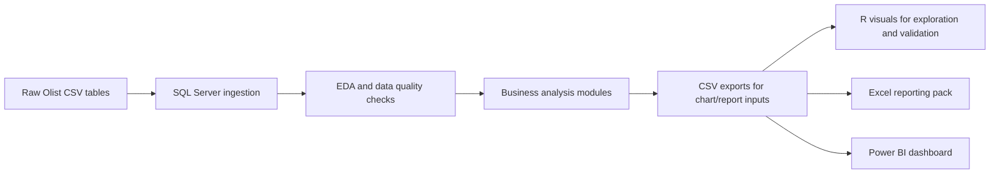

# Olist SQL Business Intelligence

> End-to-end marketplace analytics project built on real Olist e-commerce data using SQL as the analytical engine, R as the exploratory visualization layer, and Excel / Power BI as the business-facing reporting layer.

## Table Of Contents

- [Overview](#overview)
- [At A Glance](#at-a-glance)
- [Snapshot](#snapshot)
- [Project Workflow](#project-workflow)
- [What This Project Actually Shows](#what-this-project-actually-shows)
- [Tech Stack](#tech-stack)
- [Business Questions](#business-questions)
- [Progress Tracker](#progress-tracker)
- [Key Findings So Far](#key-findings-so-far)
- [Key Assumptions](#key-assumptions)
- [Repo Map](#repo-map)
- [Example Analytical Pattern](#example-analytical-pattern)
- [Reporting Layer](#reporting-layer)
- [Why This Project Is Stronger Than A Query-Only Portfolio Piece](#why-this-project-is-stronger-than-a-query-only-portfolio-piece)
- [Next Steps](#next-steps)
- [References](#references)

## Overview

This project analyzes Olist as a marketplace business, not just as a raw e-commerce dataset. The work starts with data structure and quality checks, moves into customer, seller, product, retention, and performance analysis in SQL, then pushes selected outputs into reporting layers that are easier for stakeholders to consume.

The technical idea is simple:

```text
SQL -> core business logic
R -> exploratory and analytical visuals
Excel -> analyst-facing reporting pack
Power BI -> stakeholder-facing dashboard
```

The portfolio value of this project is that it shows both sides of analytics work: deep query-based analysis and the ability to package findings into a business-ready format.

## At A Glance

| Item | Details |
|---|---|
| Project type | End-to-end business intelligence case study |
| Dataset | Brazilian E-Commerce Public Dataset by Olist |
| Scale | 100k+ orders, 9 source tables |
| Time period | September 2016 to October 2018 |
| Core tools | SQL Server, T-SQL, R, ggplot2 |
| Delivery layer | Excel and Power BI |
| Business focus | Growth, retention, concentration, seller quality, product mix, operations |
| Current phase | Advanced analytics complete for major modules; reporting and dashboard layer in progress |

## Snapshot

| Metric | Current value |
|---|---:|
| Total orders | 99,441 |
| Unique customers | 96,096 |
| Sellers | 3,095 |
| Products | 32,951 |
| Products sold | 32,216 |
| Product categories | 73 |
| Delivered GMV | 15.42M |
| Estimated platform revenue @ 20% | 3.08M |
| Average order value | 159.86 |
| Average review score | 4.09 / 5 |
| Average delivery time | 12 days |
| Median delivery time | 10 days |
| Freight as % of GMV | 14.25% |

## Project Workflow



## What This Project Actually Shows

| Capability | How it is demonstrated here |
|---|---|
| SQL depth | Complex joins, temp tables, window functions, segmentation, cohort logic, concentration analysis |
| Business thinking | Questions framed around what Olist can influence as the marketplace operator |
| Data quality discipline | Null checks, duplicates, invalid values, sequencing checks, inferred referential integrity |
| Analytical storytelling | Findings interpreted in business language rather than left as raw query output |
| Reporting readiness | SQL outputs structured for R, Excel, and Power BI consumption |

## Tech Stack

| Tool | Role in project | Status |
|---|---|---|
| SQL Server / T-SQL | Core analysis, metric definitions, data quality checks, reporting logic | Active |
| R / ggplot2 | Exploratory visuals, distribution charts, analytical support graphics | Active |
| Excel | Analyst-friendly report pack, pivot summaries, last-mile review layer | Being added |
| Power BI | Stakeholder dashboard and interactive presentation layer | Being added |
| Git / GitHub | Version control and project publishing | Active |

## Business Questions

| Theme | Questions answered |
|---|---|
| Business performance | Monthly orders, revenue, AOV, strongest/weakest months, new vs repeat mix, revenue concentration |
| Customer behaviour | Orders per customer, one-time vs repeat share, second-order gap, spend and item comparison |
| RFM segmentation | Recency, frequency, monetary scoring, segment mix, segment revenue contribution, churn-risk groups |
| Cohort retention | Return rates by cohort, retention drop-off, strongest cohorts, cohort revenue over time |
| Seller performance | Top sellers, concentration, review quality, delivery performance, growth vs decline |
| Product intelligence | Top products and categories, sales concentration, high-volume vs high-value products, repeat demand |
| Remaining modules | Review patterns, logistics quality, payment behaviour, validation, report tables |

## Progress Tracker

| Module | Status | Main output |
|---|---|---|
| `01_eda/01_database_exploration.sql` | Done | table structure, grains, date ranges, relationship map |
| `01_eda/02_data_quality.sql` | Done | nulls, duplicates, negative/zero checks, sequencing, integrity checks |
| `01_eda/03_overview_metrics.sql` | Done | platform scale, GMV, AOV, delivery, reviews, freight |
| `01_eda/04_geolocation_exploration.sql` | Done | geographic coverage and cross-region flow |
| `01_eda/05_distribution_exploration.sql` | Done | order value, freight ratio, delivery, review, calendar distributions |
| `02_analytics/01_business_performance.sql` | Done | trends, new vs repeat mix, revenue concentration |
| `02_analytics/02_customer_behaviour.sql` | Done | one-time vs repeat, second-order lag, spending pattern |
| `02_analytics/03_rfm_analysis.sql` | Done | customer segmentation |
| `02_analytics/04_cohort_analysis.sql` | Done | retention and cohort revenue |
| `02_analytics/05_seller_performance.sql` | Done | seller ranking and trend analysis |
| `02_analytics/06_product_intelligence.sql` | Done | product/category concentration and growth |
| `02_analytics/07_review_patterns.sql` | In progress | upcoming |
| `02_analytics/08_logistics_quality.sql` | In progress | upcoming |
| `02_analytics/09_payment_behaviour.sql` | In progress | upcoming |
| `03_reports/*` | Planned | business-ready report tables |
| `04_validation/cross_checks.sql` | Planned | metric reconciliation |

## Key Findings So Far

| Area | Takeaway |
|---|---|
| Retention | Olist appears much stronger at acquisition than repeat purchase retention |
| Customer mix | About 97% of customers purchase only once; repeat behaviour is limited |
| Repeat timing | When customers do come back, the median time to second order is about 29 days |
| Revenue concentration | Top 20% of customers drive about 53.5% of GMV |
| Seller concentration | Top 20% of sellers drive about 82% of GMV, indicating very high dependence on a small seller base |
| Product concentration | Top 20% of products drive about 73% of GMV |
| Geography | Supply and demand are both heavily concentrated in Sao Paulo |
| Fulfillment | About 63% of item units move across regions rather than within the same state |
| Marketplace shape | Top categories are more stable growth engines than individual top products |

## Key Assumptions

| Topic | Decision used in this project |
|---|---|
| Perspective | Marketplace operator view: what Olist can influence, incentivize, or act upon |
| GMV definition | Total delivered `payment_value`, inclusive of freight |
| Revenue term | `GMV` and `revenue` are used interchangeably in this repo unless otherwise stated |
| Commission rate | 20% midpoint assumption based on public descriptions of Olist fee structure |
| Scope | Core performance analysis focuses on confirmed and delivered orders |
| Customer key | `customer_unique_id` is treated as the real customer identifier |

## Repo Map

```text
olist-sql-business-intelligence/
|-- 01_eda/
|   |-- 01_database_exploration.sql
|   |-- 02_data_quality.sql
|   |-- 03_overview_metrics.sql
|   |-- 04_geolocation_exploration.sql
|   `-- 05_distribution_exploration.sql
|-- 02_analytics/
|   |-- 01_business_performance.sql
|   |-- 02_customer_behaviour.sql
|   |-- 03_rfm_analysis.sql
|   |-- 04_cohort_analysis.sql
|   |-- 05_seller_performance.sql
|   |-- 06_product_intelligence.sql
|   |-- 07_review_patterns.sql
|   |-- 08_logistics_quality.sql
|   `-- 09_payment_behaviour.sql
|-- 03_reports/
|-- 04_validation/
|-- data/
|-- graph_materials/
|   |-- csv/
|   `-- scripts/
|-- notes/
`-- README.md
```

## Example Analytical Pattern

```sql
WITH order_value AS (
    SELECT
        o.order_id,
        DATETRUNC(month, o.order_purchase_timestamp) AS month_year,
        SUM(p.payment_value) AS order_value
    FROM orders o
    INNER JOIN order_payments p
        ON o.order_id = p.order_id
    WHERE LOWER(o.order_status) = 'delivered'
    GROUP BY
        o.order_id,
        DATETRUNC(month, o.order_purchase_timestamp)
)
SELECT
    month_year,
    COUNT(*) AS total_orders,
    SUM(order_value) AS month_revenue,
    AVG(order_value) AS month_average_order_value
FROM order_value
GROUP BY month_year
ORDER BY month_year;
```

This is the general style used across the project: define a business question, build a clean intermediate dataset, aggregate to decision-friendly metrics, then export selected outputs for reporting.

## Reporting Layer

The project is intentionally moving beyond query output into business delivery.

| Layer | Purpose | Why it matters |
|---|---|---|
| R | Exploratory and statistical visuals | Useful during analysis and validation |
| Excel | Working report pack, pivots, one-off reviews, shareable tables | Common analyst last-mile tool |
| Power BI | Interactive dashboard for non-technical stakeholders | Best fit for meetings, KPI tracking, and business consumption |

The goal is not to duplicate every R chart in Power BI.

```text
SQL = analytical engine
R = exploratory / analytical support
Excel = analyst-facing working pack
Power BI = stakeholder-facing presentation layer
```

## Why This Project Is Stronger Than A Query-Only Portfolio Piece

- Starts with structure and data quality before jumping into insight claims
- Uses business questions to drive analysis rather than random KPI dumping
- Separates analysis, exports, charting, reporting, and dashboard delivery
- Shows both technical depth and the ability to package findings for business users
- Mirrors a realistic analyst workflow instead of a one-file notebook exercise

## Next Steps

| Priority | Planned work |
|---|---|
| High | Finish review patterns, logistics quality, and payment behaviour |
| High | Populate `03_reports` with final report-layer SQL outputs |
| High | Build `04_validation/cross_checks.sql` |
| Medium | Add Excel reporting pack outputs |
| Medium | Build Power BI dashboard and add screenshots |
| Medium | Expand final findings section once remaining modules are completed |

## References

- Olist. (n.d.). *Comissao e frete: As 3 regras que voce precisa saber.* https://blog.olist.com/3-regras-comissao-e-frete-olist/
- Bling Blog. (2022, March 7). *Nova regra de comissao e frete do Olist.* https://blog.bling.com.br/nova-regra-de-comissao-e-frete-do-olist-como-funciona-e-quais-sao-as-vantagens/
- Chen, D., Sakia, S., & Olist. (2018). *Brazilian E-Commerce Public Dataset by Olist* [Dataset]. Kaggle. https://www.kaggle.com/datasets/olistbr/brazilian-ecommerce

## Author

Nguyen Duong  
[GitHub](https://github.com/steven2512) | [LinkedIn](https://www.linkedin.com/in/nguyenduong251202/)
